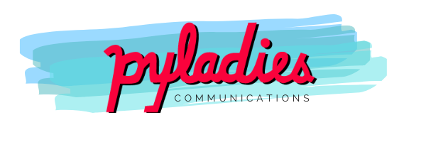
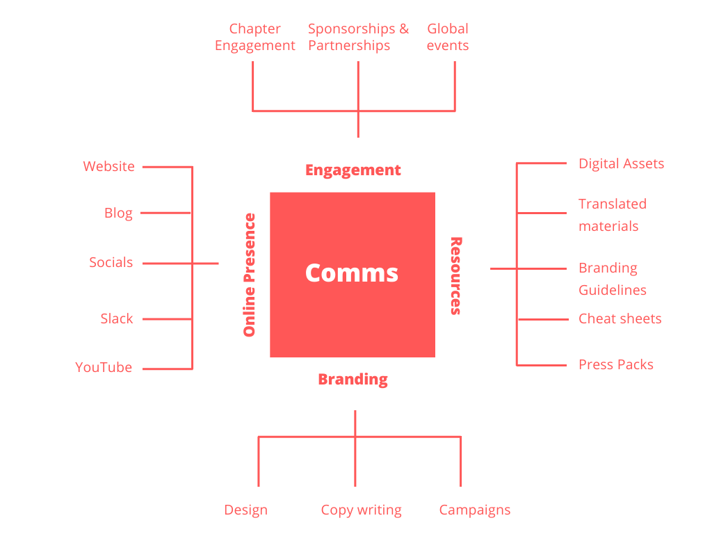

The proposal for this project can be found [here](https://github.com/pyladies/global-organizing/issues/42).

### Mission

- To handle the Global PyLadies Communication and Engagement work. 
- Work includes :
    - managing comms as it relates to inter-chapter communication and managing digital assets (e.g. blog, Slack). 

As such, Project lead(s) should include at least one seasoned PyLadies Chapter organizer, however team members can be any self-identifying PyLadies member.

### Team

Name | GitHub Handle | PyLadies Chapter | Team Role
-- | -- | -- | --
Abigail Dogbe | @AbigailDogbe  | PyLadies Ghana | Co-Lead
Lorena Mesa | @lorenanicole  | PyLadies Chicago | Adviser
Carolina Londono Agudelo | @kittylon | PyLadies Amsterdam | Co-Lead
Marie-Louise Annan | @Marie-L | PyLadies Remote | Adviser
Bethany Garcia | @BethanyG | PyLadies Oakland | Member
Juliana F. Alves | @julianafalves | PyLadies São Carlos | Co-Lead
Ana Cecelia Vieira | @cecivieira | PyLadies Recife | Co-Lead

📌 Check out the [User Manual](https://github.com/pyladies/project-communications/tree/master/user-manual-for-me) for the Projects Communication Team !

### Areas

_Team members can choose to work in one of the following areas:_

|Area | Project Lead(s)|
| -- | -- 
|1. Blog | Position needs to be filled |
|2. Website | Position needs to be filled |
|3. Slack | Alicia & Abigail|
|4. Newsletter | Abigail|
|5. Resources | Position needs to be filled|
|6. Global Events |Position needs to be filled|
|7. Chapter Lead Engagement |Position needs to be filled|
|8. Translation |Position needs to be filled|
|9. Social Media| Position needs to be filled|
|10. YouTube| Marie-Louise|
|11. Design| Marie-Louise|
|12. Sponsorship|Position needs to be filled|

### Schedule

- We work in sprints (4 week) 
- Every week we have a hack session 
- We check in regularly via slack to offer support if needed
- We meet at the end of each cycle to discuss our work during a retrospective which is followed by sprint planning

### Workflow

**New Issues**

- Co-leads will check for new issues regularly
- Co-leads will triage and assign new issues within one week

**Requests to join the team**

- Co-leads will respond to new requests / applications every week

### Contributing

If you would like to join : 

1. open an issue requesting to join using the [contributor template](https://github.com/pyladies/project-communications/issues/new/choose).
1. join our slack channel [#project-communications](https://pyladies.slack.com/archives/CQMFU03T4)

### Code of Conduct

Pyladies is dedicated to providing a respectful, harassment-free community for everyone. Please read our full code of conduct [here](https://github.com/pyladies/project-communications/tree/master/code_of_conduct).
